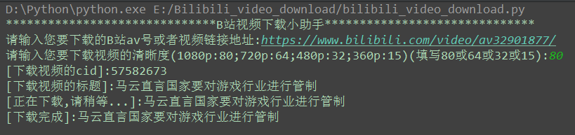
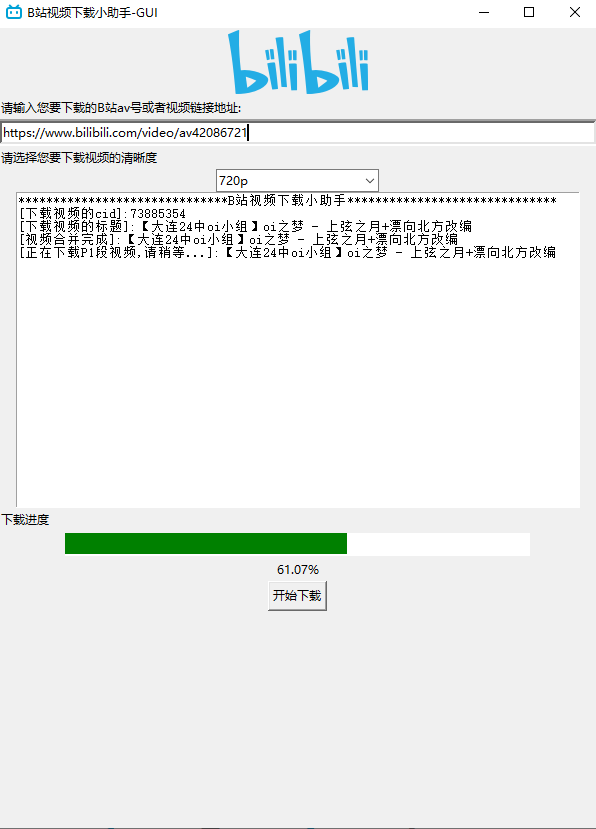
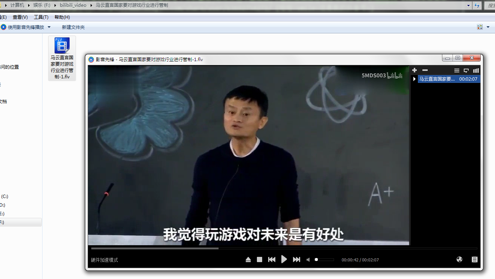

Bilibili(b站)视频下载 
===========================
  
### Bilibili官网 - https://www.bilibili.com/
|Author|:sunglasses:Henryhaohao:sunglasses:|
|---|---
|Email|:hearts:1073064953@qq.com:hearts:

    
****
## :dolphin:声明
### 软件均仅用于学习交流，请勿用于任何商业用途！感谢大家！
## :dolphin:介绍
### 该项目为[Bilibili(b站)](https://www.bilibili.com/)视频下载(支持分P多段视频的下载!)
- **对于单P视频:直接传入B站av号或者视频链接地址(eg: 49842011或者https://www.bilibili.com/video/av49842011)**
- **对于多P视频:**
  > **1.下载全集:直接传入B站av号或者视频链接地址(eg: 49842011或者https://www.bilibili.com/video/av49842011)**<br>
  > **2.下载其中一集:传入那一集的视频链接地址(eg: https://www.bilibili.com/video/av19516333/?p=2)**
## :dolphin:爬虫版本
- **版本一: bilibili_video_download_v1.py**
  > **加密API版,不需要加入cookie,直接即可下载1080p视频<br>**
- **版本二: bilibili_video_download_v2.py**
  > **1.无加密API版,但是需要加入登录后cookie中的SESSDATA字段,才可下载720p及以上视频**<br>
  > **2.如果想下载1080p+视频,需要带入B站大会员的cookie中的SESSDATA才行,普通用户的SESSDATA最多只能下载1080p视频；请定期更换代码31行cookie中的SESSDATA值。跟换方法为：浏览器登录B站，在开发者模式(按F12) --> application --> cookie中找到SESSDATA值替换即可，一个月的有效期**
- **版本三: bilibili_video_download_v3.py**
  > **即版本二的升级版,为Threading多线程下载版本,下载速度大幅提升!**<br> 

- **版本四: GUI版本 - bilibili_video_download-GUI.py**
  > **在版本三基础上加入图形界面,操作更加友好<br>**

- **版本五: bilibili_video_download_bangumi.py**
  > **在版本一,三基础上增加下载B站番剧视频(eg: https://www.bilibili.com/bangumi/play/ep269835)<br>**
## :dolphin:运行环境
Version: Python3
## :dolphin:安装依赖库
```
pip3 install -r requirements.txt
```
## :dolphin:运行截图
> - **运行下载**<br><br>

> - **GUI图形界面**<br><br>  

> - **下载完成**<br><br>

## :dolphin:**总结**
> **最后，如果你觉得这个项目不错或者对你有帮助，给个Star呗，也算是对我学习路上的一种鼓励！<br>
 哈哈哈，感谢大家！笔芯哟~**:cupid::cupid:
